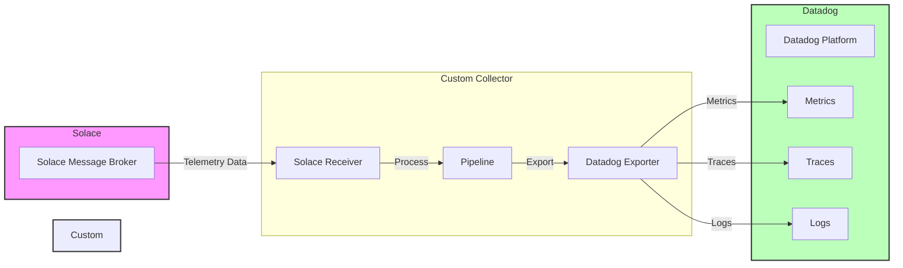

## Description of the data flow

1. **Solace Message Broker**
   - Receives telemetry data from various sources
   - Sends data to the Custom Collector

2. **Custom Collector**
   - **Solace Receiver**: Receives data from the Solace Message Broker
   - **Pipeline**: Processes the received data
   - **Datadog Exporter**: Exports the processed data to Datadog

3. **Datadog Platform**
   - Receives and processes three types of data:
     - Metrics (Metrics)
     - Traces (Traces)
     - Logs (Logs)

The configuration is done via:
- `.env` file for Datadog-specific settings
- `collector-config.yaml` for the OpenTelemetry Collector configuration 