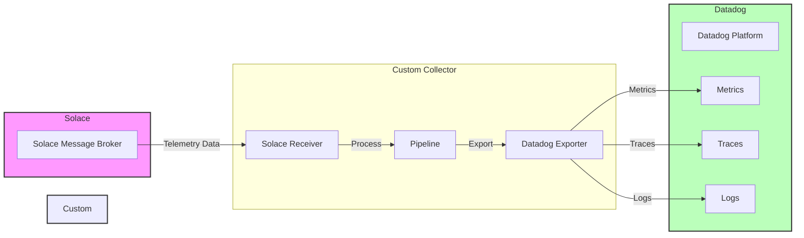

## Beschreibung des Datenflusses

1. **Solace Message Broker**
   - Empfängt Telemetriedaten von verschiedenen Quellen
   - Sendet Daten an den Custom Collector

2. **Custom Collector**
   - **Solace Receiver**: Empfängt Daten vom Solace Message Broker
   - **Pipeline**: Verarbeitet die empfangenen Daten
   - **Datadog Exporter**: Exportiert die verarbeiteten Daten an Datadog

3. **Datadog Platform**
   - Empfängt und verarbeitet drei Arten von Daten:
     - Metrics (Metriken)
     - Traces (Spuren)
     - Logs (Protokolle)

Die Konfiguration erfolgt über:
- `.env` Datei für Datadog-spezifische Einstellungen
- `collector-config.yaml` für die OpenTelemetry Collector Konfiguration 